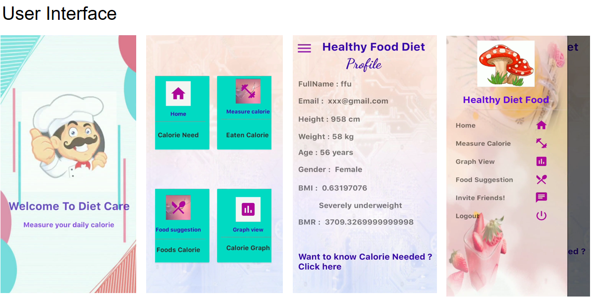
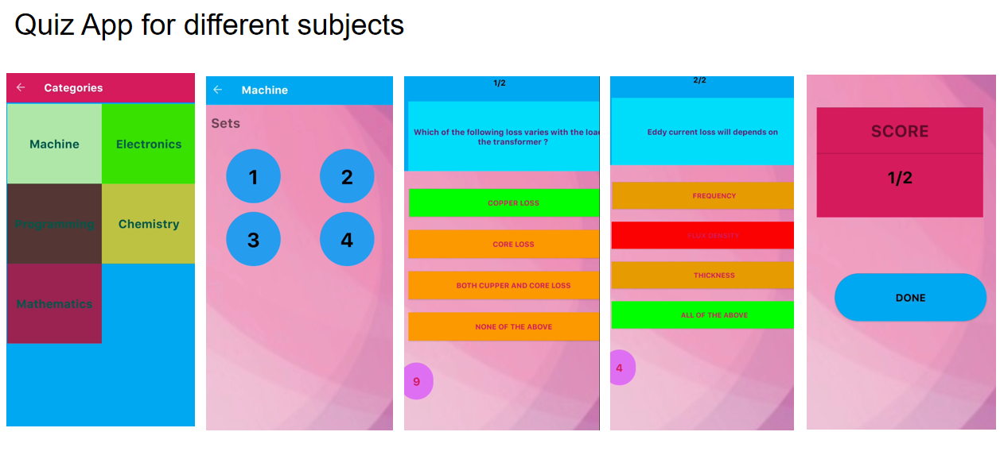
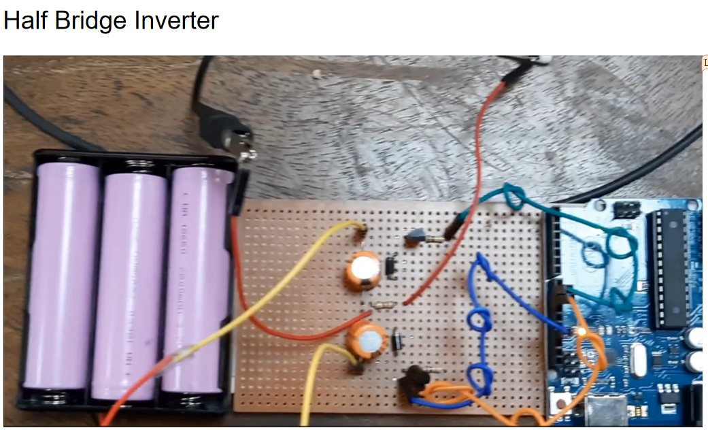

# AI & Deep learning Enthusiastic
I am an ECE graduate with a robust enthusiasm for accelerated learning and a commitment to exploring advanced concepts in academia. My primary research focus is on natural language processing, complemented by a strong passion for app development. I am dedicated to deepening my expertise in these domains and contributing to innovative advancements within the field.

# Technical Skills: 
**Programming Languages**: C, C++, Java, Python

**Database**: MySQL Server

**Numerical Analysis & Image Processing**: MATLAB

**Microprocessor Programming**: 8086 Emulator

**Network Simulator**: Cisco Packet Tracer

**Frameworks & Libraries**: NumPy, Pandas, Scikit-Learn, Matplotlib, Seaborn

**Softwares**: Android Studio, Jupyter Notebook, GitHub

# Education
- B.Sc in Electrical and Computer Engineering | Rajshahi University of Engineering & Technology (_May 2024_)

  **CGPA:** 3.78 out of 4.00
  
  **Academic Courses:** [ECE RUET Syllabus](https://ece.ruet.ac.bd/public/storage/files/ece-undergraduate-syllabus_1591597850.pdf)
  	
- Higher Secondary School Certificate	| Holy Cross College (_July 2018_)
  
  **CGPA:** 4.83 out of 5.00           		
- Secondary School Certificate | Mohammadpur Preparatory School & College (_May 2016_)
  
  **CGPA:** 5.00 out of 5.00  
  
# Projects
# *Online Food Ordering*

Successfully delivered in-depth health information including Body Mass Index (BMI), Basal Metabolic Rate (BMR), and customized calorie requirements through the creation of a user-focused Android app using Java. This accomplishment was made possible by emphasizing user-friendly design and ease of access. Furthermore, achieved accurate monitoring and management of data within the app, ensuring precise tracking of users' daily calorie consumption, through the skillful implementation of a specific feature. This success was a result of meticulous attention to detail and proficient use of Java programming skills.[(Details in Github)](https://github.com/mahbuba26/FoodAppNew)

This is the basic layout of my food ordering app, illustrating the interaction between various components. It highlights the main page interface, as well as features such as how the admin can communicate with the shop owner and other key functionalities.

The customer interface is designed with simplicity in mind, featuring an intuitive user interface that facilitates easy food ordering.

These sections demonstrate the admin handling features of the app, including the management of different food items and updates as needed. The app also provides functionalities for order processing and management, as well as tracking riders efficiently.

This section illustrates how riders manage orders and interact with customers, showcasing the functionality for efficient order handling and communication between riders and customers.

# *Calorie Counter*
Accomplished streamlined user experience as measured by enhanced user engagement and satisfaction, by developing a comprehensive Android application leveraging Java and Firebase. Integrated intuitive user interface design, admin panel for seamless management, user activity tracking, and customizable rider options.[(Details in Github)](https://github.com/mahbuba26/Diet-Care)

The custom layout of this app features a user-friendly interface designed for ease of use. It enables users to effortlessly track their daily food calories, ensuring a seamless experience for managing their dietary intake.

This layout demonstrates the functionality for measuring calorie intake, provides various food suggestions, and includes options for contacting the owner.

# *Online Quiz App*
Improved students' learning experience and assessment skills were achieved through the development of an interactive online quiz application. This was made possible by creating a user-friendly interface and providing customized multiple-choice questions, resulting in higher engagement and enhanced performance.[(Details in Github)](https://github.com/mahbuba26/Online-Quiz)

This schema outlines the structure of a quiz, categorizing various subjects and their associated sets of questions for students.

# *Car Counter using Machine Learning*
(Ongoing Project)

Led a team of three members in developing an OpenCV-based system for detecting and recording bi-directional car counts with corresponding dates.The project is presently in progress.

# *Half Bridge Inverter*

This project, undertaken by a team of three members, involved developing a basic half-bridge inverter using Arduino technology.[(Details in Github)](https://github.com/mahbuba26/Half-bridge-inverter)

The system utilized a 12V input, with the output analyzed and measured using an oscilloscope.We observed an output of approximately 5 volts.

# Courses in Coursera:
* [Programming for Everybody (Getting Started with Python)](certificates/python.pdf)
* [Algorithmic Toolbox](certificates/AlgorithmicToolbox.pdf)
* [Google Cloud Platform Fundamentals: Core Infrastructure](certificates/cloud.pdf)
* [Command Line in Linux](certificates/Linux.pdf)
* Tricky American English Pronunciation
* [Build your first Android App](app.pdf)
* University Teaching
* [Introduction to public speaking](certificates/PublicSpeaking.pdf)

# Courses in Udemy:
* The complete java course: Learn from scratch
* [Java programming:Complete beginner to advanced](certificates/Udemy/java.pdf)
* [Learn web development from scratch](certificates/Udemy/web.pdf)

# Activities
- [Performed internship in Code Studio on Machine Learning projects](Code Studio.png)
- Active Ieee member participated in different seminars ans synmosiums
- BDApps developer in Robi Axiata Ltd. 
- [Workshop on Latex for technical writing and presentation](latex.pdf)
- [Participated in IEEEXTREME 14.0 coding competition](certificates/workshop/IEEEXtreme14.0.pdf)
- [Internet of things and robotics process automation](certificates/workshop/MahbubaHabib(1).pdf)
- [Workshop on Advanced Softwares for ICT” Organized by IICT, RUET](certificates/workshop/workshop.pdf)
- Participated in Career catalyst that was organized by RUET CAREER FORUM
- [Revolutionizing Industries with Artificial Intelligence and Machine Learning](certificates/workshop/Participation_Certificate_Mahbuba.pdf)

# Thesis
1. Mahbuba Habib, Hafsa Binte Kibria, “Feature Selection-based Machine Learning Approaches for Detecting Android Malware with Explainable AI”  (Accepted in ICAEEE
2024, 3rd International Conference on Advancement in Electrical and Electronic Engineering, DUET, Dhaka, Bangladesh)

# Contact
[Gmail](mahbuba.eceruet@gmail.com)

[LinkedIn](https://www.linkedin.com/in/mahbuba-h-408b461a6/)
   

